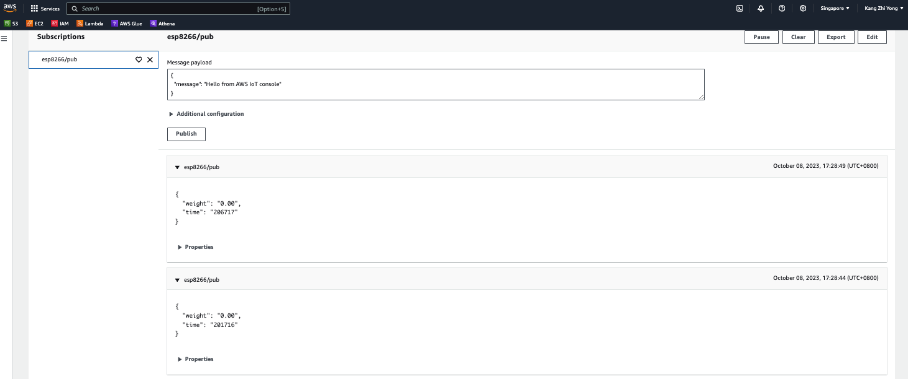
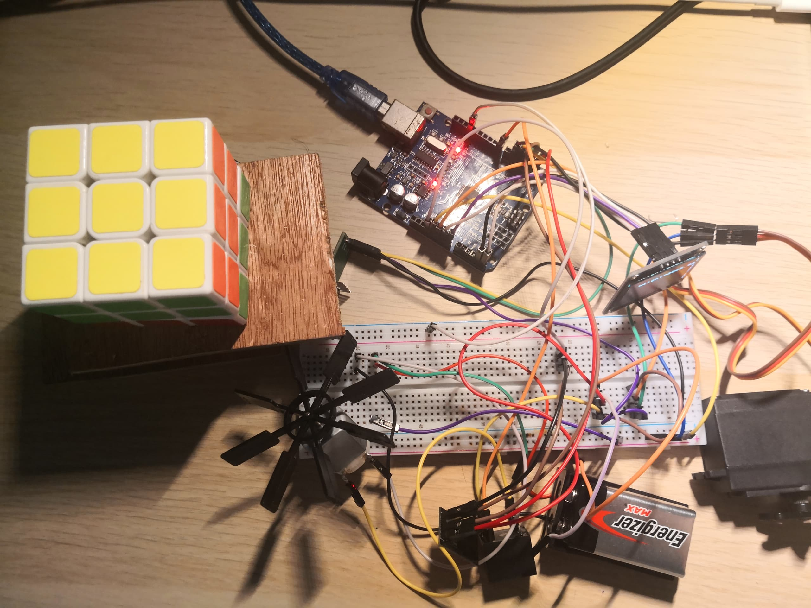

## AquaFeeder &#128031;	&#129424;
### What is AquaFeeder project?	&#128173;
A repository hosting the Arduino code for real-time monitoring of aquaculture feed's weight, and potentially served as a automatic feeding machine to improve FCR ratio in the aquaculture industry. Will incorporate in other monitoring sensor such as temperature, pH, nitrate and so on in near future. Real-time monitoring of data and its abundance is useful while coming to data-driven decision, by having a recommendation system for feed suggestion based on machine learning model. 

Continuous update of the project will be updated weekly...............................&#127939;

### Cloud Service, the AWS IOT core  &#128187;
Currently have established a MQTT connection via esp8266 WIFI modules with AWS cloud service as shown in figure. Future population of data into sql or non-sql database will be performed once other sensors have been set up................................&#127939;

## Arduino 	&#129530;
The setting up of cloud connection is mainly based on the github repositories with little modification. You may refer to the link belows. There are mainly two configuration to be maded, which are the Arduino Uno and ESP8266 WiFi modules. You may also refer to the code in this repository.

Resources for connecting ESP8266 to mqtt client: https://github.com/SmartThingsDIY/esp8266-01-aws-mqtt/blob/master/src/main.cpp

Resources for connecting ESP8266 and Adruino Uno (facilitate their communication): https://github.com/SmartThingsDIY/esp8266-01-aws-mqtt/blob/master/src/main.cpp

Continuous update of the project will be updated weekly...............................&#127939;